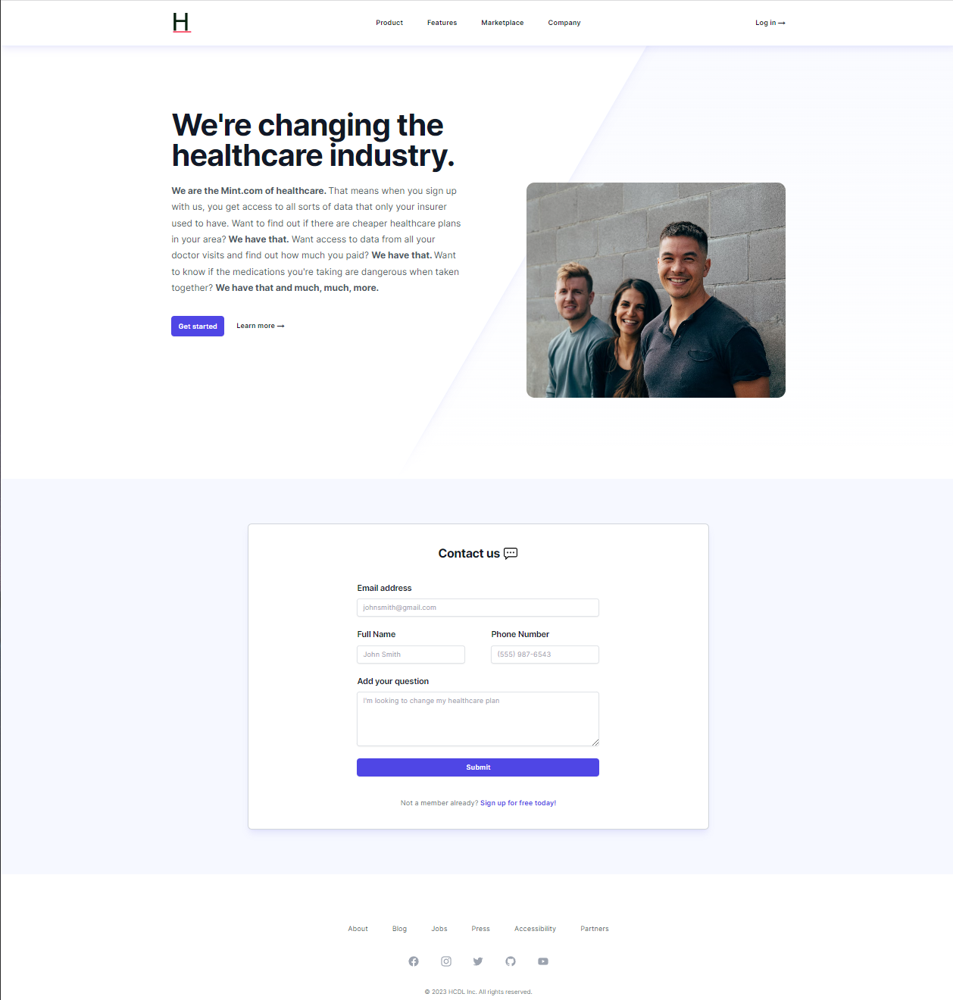

# Demo for Nylas to send emails in our app

## Link to deployed app

https://nylas-gamma.vercel.app/

## Screenshot

## Description

Nylas is a tool that could potentially be used to handle contact requests from future customers/users of HCDL. Currently this app is set up with no server or backend, but it allows a user to send an email to the specified email address. The email can contain whatever sorts of information we want to have provided, but currently it has the sender's email, full name, phone, and question. On submit we're also using React-Hot-Toast for UI/UX purposes to let the sender know that the email is being sent, and then a confirmation or a rejection toast to let the user know if the email has been sent or something error'd.

## Technologies

- Next
- Nylas
- React-Hot-Toast
- Tailwind UI
- Tailwind CSS